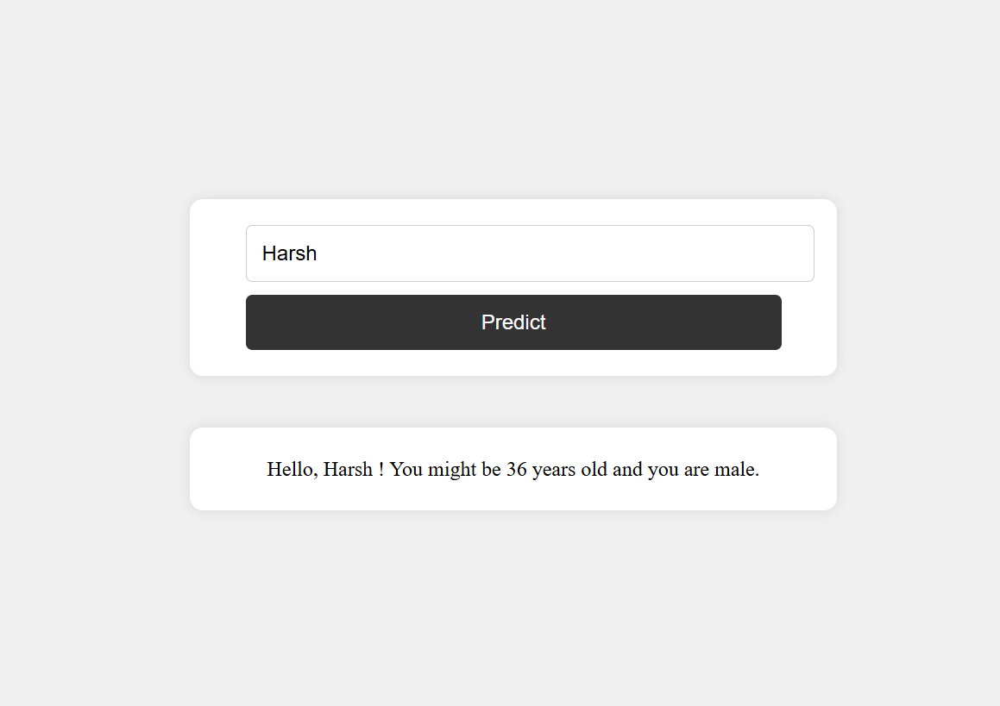

# Guess Age and Gender

This project is a simple web application that predicts the age and gender of a person based on their name. It is built using FastAPI and deployed on Vercel.

## APIs Used
- **Agify API**: [https://api.agify.io](https://api.agify.io) - Predicts the age of a person based on their name.
- **Genderize API**: [https://api.genderize.io](https://api.genderize.io) - Predicts the gender of a person based on their name.

## Features
- Enter a name to get predicted age and gender.
- Uses asynchronous API requests for efficiency.
- Built with FastAPI and Jinja2 for templating.

## Deployment
https://guess-age-and-gender.vercel.app/

